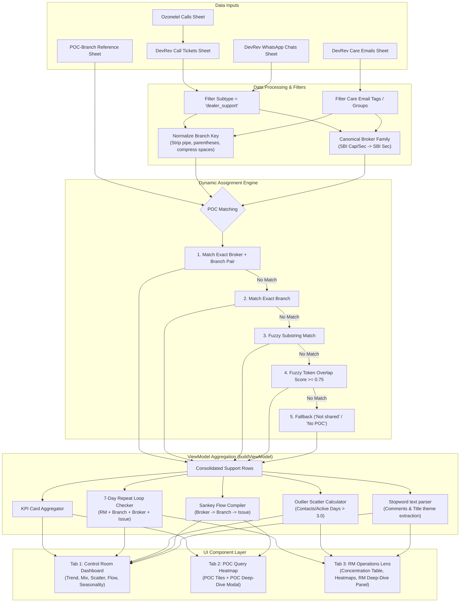

# System Blueprint & Prompt: B2B Growth & Support Analytics Dashboard

This document contains a comprehensive, UI-independent specification of the **smallcase B2B Growth Dashboard**. It is designed as a direct, step-by-step master prompt that you can copy, paste, and feed into another AI model or development environment to build a beautiful, high-performance, and perfectly calibrated dashboard from scratch.

---

## Copy-Pasteable Development Prompt

```markdown
You are an expert full-stack developer and data visualization engineer. Your task is to build a modern, high-performance, and visually stunning B2B Partner Support Analytics Dashboard using a clean, responsive framework (such as React with Chart.js/Recharts, Next.js, or pure HTML5 with Tailwind CSS and CSS variables). 

Below is the complete architectural specification, schema definitions, business logic, normalization rules, and data aggregation algorithms for the system. Build a production-ready application that implements these details precisely, ensuring the UI looks premium (using elegant dark/light modes, smooth animations, cards, glassmorphism, and a modular tabbed/drill-down architecture).

---

### SECTION 1: ARCHITECTURAL OVERVIEW & DATA CHANNELS
The dashboard aggregates partner support activities across several distinct data sheets/channels. The system must support loading this data (via CSV/JSON upload or a simulated/live API) and perform all calculations client-side or server-side based on the following schemas:

#### 1. Ozonetel Calls (Voice Call Records)
*   **Purpose**: Raw telecom log of inbound partner calls.
*   **Key Fields**:
    *   `Call Type` (Inbound/Outbound)
    *   `Call Date` (yyyy-MM-dd HH:mm:ss)
    *   `Caller No` (Customer phone number)
    *   `Time to Answer`, `Hold Time`, `Talk Time`, `Duration` (in seconds)
    *   `Agent` (Name of the support agent)
    *   `Status` (Answered, Missed, Abandoned, AOH)
    *   `Recording URL` (URL to call audio)

#### 2. Ozonetel DevRev Tickets (Call Tickets)
*   **Purpose**: DevRev support tickets created automatically or manually from phone calls.
*   **Filter criteria**: `type` is `ticket` and `subtype` is `dealer_support`.
*   **Key Fields**:
    *   `Work ID` (Unique ticket identifier, e.g. TKT-1234)
    *   `Title` (Summary of the call ticket)
    *   `Created date`, `Modified date`, `Close date` (Timestamps in IST)
    *   `Owner[0]` (Assigned agent)
    *   `Reported by[0]` / `Created by` (Typically the RM who called)
    *   `Stage` (New, Open, In Progress, Resolved, Closed)
    *   `Severity.label` (Low, Medium, High, Blocker)
    *   `SLA Name.name` / `SLA Name.status` (e.g. breached vs met)
    *   `Broker Name` (e.g. SBI, HDFC, Motilal)
    *   `Branch/Location` (Partner branch address/name)
    *   `Issue Type (B2B)`, `Sub Issue Type (B2B)` (Categorization)
    *   `Comments` (Free-text notes on resolution)
    *   `Overall Score (45)` (AI Quality Score details out of 45)

#### 3. WhatsApp Chats (DevRev Conversations)
*   **Purpose**: Chat logs from partner WhatsApp channels.
*   **Filter criteria**: `conversations_subtype` is `dealer_support`.
*   **Key Fields**:
    *   `ID` (Unique conversation identifier)
    *   `Last Message` (Reference text or ID of the last message)
    *   `Created date`, `Modified date` (Timestamps)
    *   `Owners[0]` (Assigned support agent)
    *   `Created by` / `RM Name` (The RM contacting the channel)
    *   `Stage` (Open, Closed, Snoozed)
    *   `Branch/Location` (Partner branch location)
    *   `Broker ID (B2B)` / `RM Broker Name` (Broker family identification)
    *   `Issue Type (B2B)`, `Sub Issue Type (B2B)` (Categorization)
    *   `Comments` (Resolution comments or text body summary)

#### 4. Care Emails (DevRev Email Tickets)
*   **Purpose**: Support tickets received via email.
*   **Filter criteria**: Tags include `care@smallcase.com` or `caresc@smallcase.com` OR assigned group display name is `Care Emails`.
*   **Key Fields**:
    *   `Work ID` (Unique identifier)
    *   `Title`, `Body` (Subject and text body)
    *   `Created date`, `Modified date`, `Close date` (Timestamps)
    *   `Owner[0]` (Support agent)
    *   `Reported by[0]` (Email sender)
    *   `Stage` (New, Open, Closed, etc.)
    *   `Sentiment.label` (Positive, Neutral, Negative)

#### 5. Ozonetel Agent Breaks
*   **Purpose**: Logs of support agent break durations.
*   **Key Fields**: `Date`, `Agent Name`, `Break Start Time`, `Break End Time`, `Breaks` (Category, e.g. Lunch, Tea), `Total Break Time`.

#### 6. POC-Branch Mapping (The Org Reference Matrix)
*   **Purpose**: Master configuration mapping which internal smallcase employee (POC) is responsible for which partner branch/broker combination.
*   **Key Fields**: `Branch/Location`, `Broker Name`, `POC Name`.

---

### SECTION 2: CORE BUSINESS & NORMALIZATION LOGIC
Implement these exact normalization rules programmatically. The dashboard must run these sanitization filters before any charts or KPIs are computed:

#### 1. Canonical Broker Family Identification
To prevent duplicate broker names (e.g. "SBI Securities", "SBI Cap", "sbi sec" representing the same entity), map broker fields through this function:
*   Convert the broker string to lowercase and strip all non-alphanumeric characters.
*   If the result starts with **"sbi"**, return **"SBI Sec"**.
*   If the result starts with **"hdfc"**, return **"HDFC Sec"**.
*   Otherwise, return the trimmed, original capitalized string. If empty or null, return **"NA"**.

#### 2. Branch/Location Key Normalization
Different channels capture branch names with slight variations (e.g., "J.P. Nagar | Branch", "JP Nagar (Main)", "J P Nagar"). Normalize branch strings as follows:
1.  Convert to lowercase and replace non-breaking spaces with standard spaces.
2.  If the string contains a pipe symbol `|`, extract the substring after the last pipe (e.g. `South Zone | Pune` -> `pune`).
3.  Remove anything inside parentheses, including the parentheses (e.g. `mumbai (main)` -> `mumbai`).
4.  Remove words like `branch`, `main branch`, or `barnch`.
5.  Replace all non-alphanumeric character sequences with a single space.
6.  Compress spaces (e.g. `j p nagar` -> `jpnagar` or strip spaces between single letters).
7.  Trim whitespace. If the branch is missing, invalid, or matches placeholders (like "not shared", "not clear", "blank call", "no response", "none"), label it as **"Not shared"**.

#### 3. Dynamic POC/Zone Assignment Logic
Every support interaction must be mapped to an internal Point of Contact (POC) using the `POC-Branch` mapping sheet. Since branch names in support logs are highly unstructured, use this multi-tier fuzzy matching algorithm:
*   **Step 1 (Direct Broker-Branch Pair Match)**: Look up the POC using the exact `Canonical Broker Family` + `Normalized Branch` pair from the mapping sheet.
*   **Step 2 (Exact Branch Match)**: If no match, look up by `Normalized Branch` alone.
*   **Step 3 (Substring Match)**: If no match, check if the normalized branch name from the ticket exists inside a branch name in the mapping sheet, or vice-versa.
*   **Step 4 (Fuzzy Token-Overlap Match)**: If still no match:
    *   Split the ticket's normalized branch name into word tokens.
    *   Split candidate branch names from the mapping sheet into tokens.
    *   Compute the overlap count (number of shared tokens).
    *   Calculate the match score = `overlap / max(1, min(candidate_token_count, ticket_token_count))`.
    *   If the overlap is $\ge 2$ words and the match score $\ge 0.75$, select that POC.
*   **Step 5 (Fallback)**: If the branch is classified as `"Not shared"`, assign the POC to `"Not shared"`. If the branch has a value but no POC matches, assign `"No POC"`. If the branch value is `"smallcase"`, assign the POC `"smallcase"`.

---

### SECTION 3: KEY PERFORMANCE INDICATORS (KPIs)
The dashboard header must show these high-level consolidated cards, responsive to any selected date range and filters:
1.  **Total Interactions**: Sum of (Call Tickets + WhatsApp Chats + Care Emails) in the active slice.
2.  **Call Tickets**: Count of DevRev Call Tickets.
3.  **WhatsApp**: Count of WhatsApp conversations.
4.  **Care Emails**: Count of Care emails.
5.  **Active RMs**: Count of unique, non-null RM Names across all support channels.
6.  **Active Brokers**: Count of unique Canonical Broker Families in the current selection.
7.  **Active Branches**: Count of unique Normalized Branches (excluding "Not shared" and "NA").
8.  **Active POCs**: Count of unique POC names mapped in the selection.
9.  **Repeat 7-day Loops**: Count of unique repeating issue combinations (see logic below).
10. **Average Daily Load**: The sum of daily averages for Call Tickets, WhatsApp, and Emails over the selected time window.

---

### SECTION 4: ADVANCED OPERATIONS ANALYTICS & PATTERNS
The system must calculate these four complex analytics modules locally:

#### 1. Repeat 7-Day Loops (Systemic Friction Detection)
*   **Purpose**: Identify repeat queries from the same Relationship Manager (RM) about the same issue.
*   **Logic**:
    1.  Group the active dataset (excluding generic "General/General" issues) by the composite key: `[RM Name] + [Broker Family] + [Branch/Location] + [Issue Type]`.
    2.  For each group, sort all ticket/chat creation timestamps chronologically.
    3.  Iterate through the sorted timestamps. If the difference between consecutive timestamps is **$\le 7$ days** (604,800,000 ms), increment the "repeat count" for that group.
    4.  Display the top groups in descending order of repeat counts. Any group with a repeat count $>0$ represents a systemic failure loop.

#### 2. Outlier Contact Frequency & RM Concentration
*   **Purpose**: Identify RMs or Branches exhibiting unusually high volume.
*   **Logic**:
    1.  For each unique RM (or Branch), calculate:
        *   `Total Contacts`: Count of support tickets/chats.
        *   `Active Days`: Number of distinct calendar days in which they created at least one ticket/chat.
        *   `Contacts per Day`: `Total Contacts / Active Days`.
    2.  An RM is classified as an **Outlier** if they exceed a configurable threshold (e.g., `Contacts per Day > 3.0` and `Total Contacts >= 5`).
    3.  Plot this as an interactive Scatter Plot: X-axis = `Active Days`, Y-axis = `Total Contacts`, with bubbles sized by `Contacts per Day`. Highlight outlier bubbles in red.

#### 3. Broker → Branch → Issue Flow (Sankey / Flow Path)
*   **Purpose**: Visualize how support volume cascades from brokers down to branch locations and specific issues.
*   **Logic**:
    1.  Extract "Insight Rows" (filter out rows where `Issue` is "General" and `Sub-Issue` is "General", and where `Branch` is "NA" or "Not shared").
    2.  Define three columns of nodes:
        *   **Left Column**: Top 5 Broker Families.
        *   **Middle Column**: Top 6 Branch Locations.
        *   **Right Column**: Top 6 Issue Types (formatted as `[Issue Type] / [Sub-Issue Type]`).
    3.  Compute two sets of weighted links:
        *   `Link Set A (Broker → Branch)`: Frequency of transactions between the top brokers and top branches.
        *   `Link Set B (Branch → Issue)`: Frequency of transactions between the top branches and top issues.
    4.  Render this as a Sankey Diagram or a custom SVG Node-Link flow chart showing volume thicknesses.

#### 4. Comment & Theme Extraction (Unstructured Text Analytics)
*   **Purpose**: Surfaces key keywords from unstructured comments or text fields.
*   **Logic**:
    1.  Extract all text from the `Comments`, `Body`, `Last Message`, `Title`, or `Agent Messages` fields.
    2.  Tokenize, lowercase, and clean the text (removing HTML tags, punctuation, and common English stopwords).
    3.  Count word frequencies.
    4.  Filter for relevant domain keywords (e.g., "login", "password", "settlement", "payout", "otc", "onboarding", "broker", "feed").
    5.  Display a bar chart or keyword list representing the top themes, and display a list of the 4 most recent raw comments for quick qualitative context.

---

### SECTION 5: SEASONALITY & CHANNEL TRENDS
To understand support seasonality, compute and plot:
*   **Day of Week Distribution**: Group call tickets, WhatsApp chats, and care emails by day of the week (Sunday to Saturday) to visualize weekend/weekday loading differences.
*   **Monthly Load Trend**: Group interactions by `yyyy-MM` format of creation date to show growth or decline over long windows.
*   **Channel Mix**: A pie/donut chart representing the proportion of support handled by Call Tickets vs WhatsApp vs Care Emails.

---

### SECTION 6: THE USER INTERFACE & MODULAR WORKSPACE
Build a premium, highly responsive user interface with the following layout and interactive elements:

#### 1. Global Controls & Filters
*   **Date Presets**: Quick-click buttons for "Today", "Yesterday", "Last 7 days", "Last 30 days", "This month", and "This year".
*   **Custom Date Inputs**: Dual HTML date pickers (`From` and `To`) with an "Apply Range" button.
*   **Dropdown Filters**:
    *   **Channel Select**: Combined, WhatsApp, Call Tickets, or Care Emails.
    *   **Broker Family Select**: Dynamic dropdown showing all active broker families.
    *   **POC Select**: Dynamic dropdown showing all mapped POC names.

#### 2. Layout Structure
Organize the dashboard into three cohesive tabs/sections:
1.  **Tab 1: Control Room Dashboard (Visual First)**
    *   KPI Grid (Consolidated metrics cards).
    *   Row 1: Line/Area charts showing Call Tickets, WhatsApp, and Emails over time.
    *   Row 2: Bar charts showing Top RMs and Top Brokers.
    *   Row 3: Top Issues and POC Hotspots.
    *   Row 4: Day of Week distribution and Monthly trends.
    *   Row 5: Sankey/Flow Diagram alongside Outlier Scatter plot and Repeat Loops.
2.  **Tab 2: POC Query Heatmap (Point of Contact Grid)**
    *   A grid of interactive cards (Tiles) for each POC.
    *   Each tile shows: POC Name, Total Contacts, Channel Mix, Top Mapped Branch, Top Active RM, Primary Issue, and the number of repeating clusters.
    *   **Interaction**: Clicking a POC Tile opens a **POC Deep-Dive Modal**.
3.  **Tab 3: RM Operations Lens (RM Explorer)**
    *   High-level analytics specifically tracking RM contact frequency.
    *   Displays RM Concentration list (RM Name, Contacts, Active Days, Contacts/Day, Top Branch, Top Broker, Top Issue).
    *   Displays Branch Friction and Issue Type × Branch Heatmap matrices.
    *   **Interaction**: Clicking any RM, Branch, or Broker chip updates an **RM Deep-Dive panel** below, displaying complete context, linked tickets, and raw resolution logs.

---

### SECTION 7: INTERACTIVE DEEP-DIVE MECHANICS (MODALS & PANELS)
When a user drills down, implement these mechanics:

#### 1. POC Deep-Dive Modal
Triggered when a POC Tile is clicked. The modal should fetch all rows belonging to branches/brokers assigned to that POC and display:
*   KPI cards specific to the POC (Total Contacts, WhatsApp vs Call mix, Active RMs, Top Broker).
*   A table of **Top RM Contact Frequency** in their domain.
*   Detailed breakdowns of their branches, issues, sub-issues, and channels.
*   A scrollable table of all raw underlying records with IDs, RMs, branches, comments, and links to recording URLs.

#### 2. RM Operations Deep-Dive Panel
Triggered when an RM, Broker, or Branch chip is clicked in the RM Lens tab.
*   Filter the dashboard in real-time to that specific RM/Broker/Branch.
*   Render a dedicated detailed view showing total contacts, top issues, and a sample of resolution comments.
*   Show a table of all connected DevRev ticket IDs, stages, owners, comments, and external link URLs.

---

### TECH STACK RECOMMENDATION & UI SPECIFICATIONS
*   **CSS Style**: Sleek dark mode / light mode toggle. Use smooth transitions (`transition: all 0.3s ease`). Implement visual glassmorphism (`background: rgba(255, 255, 255, 0.72); backdrop-filter: blur(20px); border: 1px solid rgba(15, 23, 42, 0.06)`).
*   **Chart Rendering**: Use Chart.js or Recharts with custom tooltips, beautiful gradients, and high contrast colors suited to dark/light themes.
*   **Data Handling**: Ensure all filters run Reactively. Changing a global filter must immediately recompute the entire view model (`buildViewModel()`) and update all charts and tables without page reloads.
*   **Performance Optimization**: Cache normalized keys (such as normalized branch keys and dynamic POC mappings) so they do not have to be recomputed on every render.
```

---

## Technical Architecture & Flow Mapping

The diagram below outlines how raw logs are parsed, normalized, mapped to POCs, and aggregated into visual components within the dashboard:



---

## Mathematical Logic Reference Sheet

Below is a reference summary of the algorithms and metrics calculated by the dashboard engine:

| Metric Name | Mathematical Definition / Logic | Target Use Case |
| :--- | :--- | :--- |
| **Total Interactions** | $$N = \sum C_{tickets} + \sum W_{chats} + \sum E_{emails}$$ | Core volume indicator |
| **Average Daily Load** | $$\text{AvgDaily} = \frac{N}{\text{Total Days in Period}}$$ | Predict daily bandwidth needs |
| **Fuzzy Token Overlap Match Score** | $$\text{Score} = \frac{|T_{ticket} \cap T_{candidate}|}{\max(1, \min(|T_{ticket}|, |T_{candidate}|))}$$ | Dynamic POC allocation for unstructured branch data |
| **Repeat 7-Day Loop** | $$C_{consecutive} \text{ where } (t_i - t_{i-1}) \le 7 \text{ days}$$ | Systemic unresolved issue detection |
| **Outlier Contact Frequency** | $$\text{Outlier RM} \iff \left( \frac{\sum C_{RM}}{\text{Active Days}} > 3.0 \right) \land (\sum C_{RM} \ge 5)$$ | Partner education & branch training focus |
| **Sankey Link Weight** | $$W_{A\to B} = \sum R \text{ where } \text{Source} = A \land \text{Target} = B$$ | Visual support load path tracking |
| **Normalized Branch String** | $$s \gets \text{lowercase}(s) \to \text{strip\_pipe}(s) \to \text{strip\_parens}(s) \to \text{strip\_words}(s)$$ | Standardize branch reporting keys |
